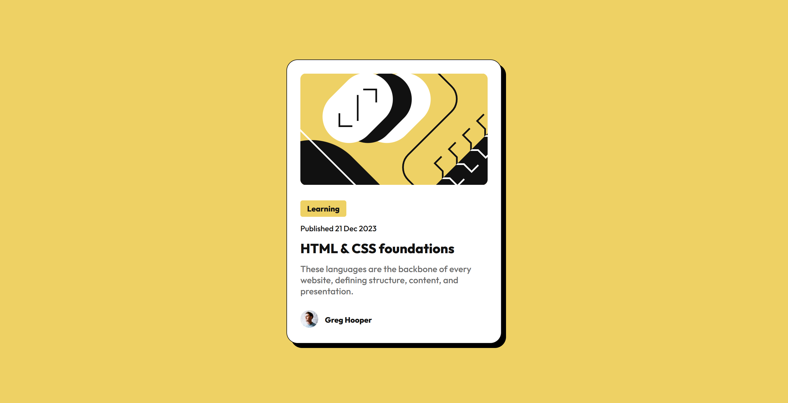

# Frontend Mentor - Blog preview card solution

This is a solution to the [Blog preview card challenge on Frontend Mentor](https://www.frontendmentor.io/challenges/blog-preview-card-ckPaj01IcS). Frontend Mentor challenges help you improve your coding skills by building realistic projects. 

## Table of contents

- [Overview](#overview)
  - [The challenge](#the-challenge)
  - [Screenshot](#screenshot)
  - [Links](#links)
- [My process](#my-process)
  - [Built with](#built-with)
  - [What I learned](#what-i-learned)
  - [Continued development](#continued-development)
  - [Useful resources](#useful-resources)
- [Author](#author)

**Note: Delete this note and update the table of contents based on what sections you keep.**

## Overview

### The challenge

Users should be able to:

- See hover and focus states for all interactive elements on the page

### Screenshot



### Links

- Solution URL: [Add solution URL here](https://your-solution-url.com)
- Live Site URL: [Add live site URL here](https://your-live-site-url.com)

## My process

I subscribed to a paid Figma subscription to use Dev Mode. This makes pulling CSS and custom properties easier. I wanted to get familar with a professional workflow as soon as possible. I am not a total beginner at CSS so I thought this was a good approach to save some time.

I also used CSS variables from the start for the colour palette, spacing and font sizes.

### Built with

- Semantic HTML5 markup
- CSS custom properties
- CSS clamp()
- Flexbox
- Figma Dev Mode
- [CSS Clamp Calculator](https://clamp-calculator.netlify.app)

### What I learned

I had to brush up on Flexbox which I used for the main card content. Learned that by default items stretch to full width. After trying unsuccessfuly to get inline-block to work, the correct fix was to assign the `align-self: flex-start` property to the category.

```css
.card .content {
  display: flex;
  flex-direction: column;
  gap: var(--spacing-150);
}

.card .category {
  align-self: flex-start;
}
```

### Responsive Fonts

To avoid using media queries, I used a technique I learned a while ago, to use the clamp() function to dynamically scale fonts based on the view width, from the mobile size up to the desktop size.

First I added three CSS variables for the three font sizes on desktop:-

```css
 --font-size-heading: 2.4rem;
 --font-size-body: 1.4rem;
 --font-size-desc: 1.6rem;
```

The equivalent mobile sizes are:-

```css
 --font-size-heading: 2rem;
 --font-size-body: 1.2rem;
 --font-size-desc: 1.4rem;
```

To implement the variable font sizes, I used the following utility to create the clamp() function for each CSS variable.

[CSS Clamp Calculator](https://clamp-calculator.netlify.app)

Note: I'm using the 62.5% root font size trick, so I can use rems instead of pixels, where 1 rem = 10px so the maths is easy :) In the utility, set 1rem = 10px to reflect this.

First I set the two view widths for desktop and mobile which are 1440px and 375px respectively (from the style guide).

For each variable, setting the min/max font sizes from the mobile/desktop sizes, produces the following:-

```css
--font-size-heading: clamp(2rem, 1.859rem + 0.376vw, 2.4rem);
--font-size-body: clamp(1.2rem, 1.13rem + 0.188vw, 1.4rem);
--font-size-desc: clamp(1.4rem, 1.33rem + 0.188vw, 1.6rem);
```

### Useful resources

- [CSS Clamp Calculator](https://clamp-calculator.netlify.app) - This calculated the CSS clamp functions as outlined above.

## Continued development

I will continue reading up on Flexbox.

## Author

- Website - [Chris Tattum](https://christattum.com)
- Frontend Mentor - [@christattum](https://www.frontendmentor.io/profile/christattum)
- X - [@christattum](https://www.x.com/christattum)
- Bluesky - [@christattum](https://bsky.app/profile/christattum.bsky.social)

